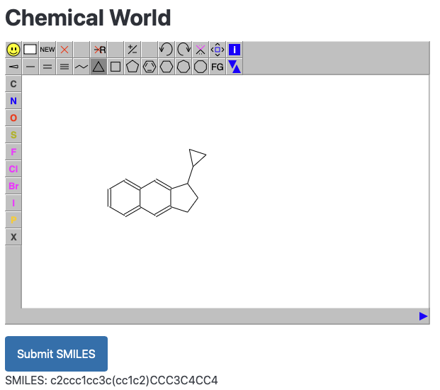

# fasthtml-jsme

How to integrate a JavaScript library into fasthtml and how to draw molecules with JSME. This was a reoccurring task for me in the past and I thought it would be a nice exercise with the new fasthtml library.



It's less than 50 lines of python to render a website with a JSME molecule editor and a button to get the SMILES string of the molecule. To be actually useful, you would need to add some server side code to handle the SMILES string, but that's not the point of this example.

If you didn't know about fasthtml, it's a python library to generate HTML code in a more pythonic way (a very opinionated way). You can find more explanations and tutorials in the [fasthtml dcumentation](https://docs.fastht.ml/). It's an interesting pice of code, written in the [literate programming](https://www.youtube.com/watch?v=l7zS8Ld4_iA) system [nbdev](https://nbdev.fast.ai) and the core functionality is in a single [jupyter notebook](https://github.com/AnswerDotAI/fasthtml/blob/main/nbs/api/00_core.ipynb).

## Preparation

If you want to run this code, you need to install the fasthtml library. You can do this with pip:

```bash
pip install python-fasthtml
```

As fasthtml is a very young library, it might change functionality and it's wise to update it regularly.

You can also download the JSME JavaScript library from the [JSME website](https://jsme-editor.github.io) and put it in an assets folder in this repo (or change the path in the code).

## Walkthrough

```python
from fasthtml.common import * 

jsme = Script(src="assets/jsme/jsme.nocache.js")
jsmestyle = Link(rel="stylesheet", href="assets/jsme/bootstrap.css", type="text/css")
```

Fasthtml should be imported with the `*` wildcard, it's a bit controversial to do this, but it is designed with this in mind. The two other lines create headers for the JavaScript and CSS files of the JSME library.

```python
jsme_script = """
function jsmeOnLoad() {
    jsmeApplet = new JSApplet.JSME("jsme_container", "600px", "400px");
}

htmx.on("htmx:configRequest", (event) => {
    let smiles = jsmeApplet.smiles();
    event.detail.parameters['smiles'] = smiles;
});
"""
```

The JSME script part itself is wrapped in a multiline python string (if you need to debug this part, it's a good idea to do it in a separate file). The `jsmeOnLoad` function is called when the JSME applet is loaded and creates a new JSME applet in the `jsme_container` div. The `htmx.on` function is a hook to the htmx library ([htmx](https://htmx.org) is the main mechanism for interactivity in fasthtml), which is used to send the SMILES string to the server when a htmx request is made. This setting will modify all htmx requests to include the SMILES string parameter, be sure to adjust this to your needs.

```python
app, rt = fast_app(hdrs=(jsme,jsmestyle))

# For images, CSS, etc.
@app.get("/{fname:path}.{ext:static}")
def static(fname:str, ext:str): return FileResponse(f'{fname}.{ext}')
```

`fast_app` is a function that creates a fasthtml app and a router. The `hdrs` parameter is used to add the JSME headers to the app. The `static` functions is used to serve static files from inside or below the `/` folder (you can place an image in the repo and link to it in your html and it will be served and available).

```python
@rt("/")
def get():
    return Titled("Chemical World", 
        Div(id="jsme_container", style="width: 600px; height: 400px;"),
        P(),
        Button("Submit SMILES", 
               hx_post="/submit_smiles", 
               hx_trigger="click",
               hx_target="#results"),
        Div(id="results"),
        Script(jsme_script)
                  )
```

This `get` function is the main part of the code. It creates a titled page with a JSME container, a button to submit the SMILES string, a div to show the results and the JSME script. `Titled` places some basic styling on your elements and is a good starting point. But you can also build everything from scratch with `div` if you like.

 The `hx_post`, `hx_trigger` and `hx_target` parameters are used to create an htmx request when the button is clicked. The `hx_post` parameter is the URL to send the request to, the `hx_trigger` parameter is the event that triggers the request and the `hx_target` parameter is the target to update with the response.

```python
@rt("/submit_smiles")
def post(smiles:str):
    return Div(f"SMILES: {smiles}", id="results")
```

The last function is executed when the button is clicked. It receives the SMILES string from the JSME applet and returns a div with the SMILES string. This is a very simple example, but you can do anything you like with the SMILES string here. HTMX replaces the content of the empty `#results` div with the response of this function.

Finally, `serve()` is a little convenience function to run the app with uvicorn (by default served at `http://localhost:5001`). You could also run the app with `uvicorn app:app --reload` from the command line.

With `serve()` it's just a single python command to run the app:

```bash
python jsme.py
```